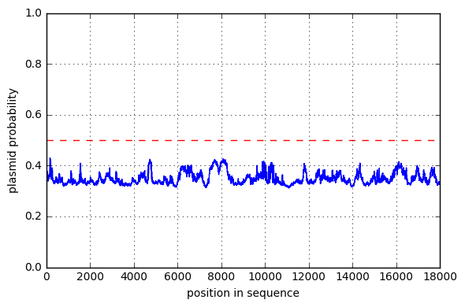

# plasmidminer

detection of plasmid fragments in metagenomic samples

# draft manuscript
https://www.overleaf.com/7758191crzmzwwcxftk


## prediction of multiple sequences from FASTA file

```
usage: predict.py [-h] [-i INPUT] [-m MODEL] [-s] [-p] [--version]

optional arguments:
  -h, --help            show this help message and exit
  -i INPUT, --input INPUT
                        Path to input FASTA file
  -m MODEL, --model MODEL
                        Path to model (.pkl)
  -s, --split           split data based on prediction
  -p, --probability     add probability information to fasta header
  --version             show program's version number and exit
```

i.e. to split input.fasta bases on plasmid prediction use:

```
python plasmidminer/predict.py --input input.fasta --model model.pkl --split --probability
```

if the `--split` command is added, this will create two fasta files `input.fasta.plasmids` and `input.fasta.chromosomes`

## prediction of plasmid probablility within a genome

you can use the sliding window approach `python plasmidminer/predict.py --sliding --window 200 -i input.fasta` to generate the plasmid probability plot for a input FASTA file



## generation of datasets

this script downloads the train/test dataset from ncbi and creates various models

```
usage: plasmidminer.py [-h] [-t TAXA] [-a PLANUM] [-b CHRNUM] [-c CHUNKSIZE]
                       [-e EMAIL] [--version]

optional arguments:
  -h, --help            show this help message and exit
  -t TAXA, --taxa TAXA  Taxonomic name for downloaded samples
  -a PLANUM, --planum PLANUM
                        Number of plasmids to be downloaded
  -b CHRNUM, --chrnum CHRNUM
                        Number of chromosomes to be downloaded
  -c CHUNKSIZE, --chunksize CHUNKSIZE
                        Chunk size in nt
  -e EMAIL, --email EMAIL
                        Email adress needed for ncbi file download
  --version             show program's version number and exit

```


## train
to generate the pkl object for classification please run
```
usage: train_svm.py [-h] [--model MODEL] [--features FEATURES] [--kmers KMERS]
                    [--balanced] [--version]

optional arguments:
  -h, --help           show this help message and exit
  --model MODEL        Patho to model file.
  --features FEATURES  Path to features matrix
  --kmers KMERS        Path to features matrix
  --balanced
  --version            show program's version number and exit
```

output:
on a balanced subset with 3k instances (E. coli) 200nt long:
```
ROC AUC: 0.86 (+/- 0.02) [Logistic Regression]
ROC AUC: 0.92 (+/- 0.01) [Random Forest]
ROC AUC: 0.71 (+/- 0.01) [SVM]
ROC AUC: 0.93 (+/- 0.01) [Majority Voting]
```


## parameter tuning
best SVN paramets based on grid search (precision/recall scores)

`python plasmidminer/svm_grid.py --balanced`

```
Best parameters set found on development set:

{'kernel': 'rbf', 'C': 1, 'gamma': 0.0001}
```

## install
you may want use virtualenv:

`virtualenv env`
`source env/bin/activate`

to install plasmidminer just type: `python setup.py install`

tested with python 2.7.12


`sudo apt-get install libmysqlclient-dev libpq-dev libboost-all-dev`

### train
`python plasmidminer/plasmidminer`

